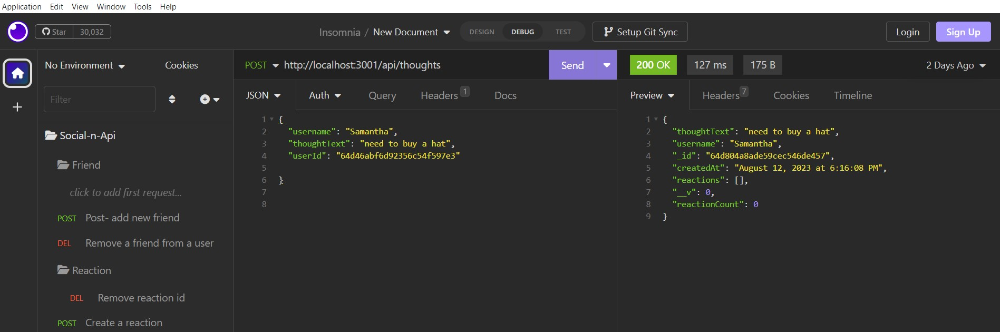

# Social-Network-API

## License

## Description
The project is a social network Api application  where the user can share their thoughts and react  to friends thoughts and create a friend list. There are api routes to perform RESTful CRUD operations with the ability to create, update, and delete entries in the database.

## Table of Content
- [Description](#description)
- [Installation](#installation)
- [Usage](#usage)
- [License](#license)
- [References](#references)
- [Contact](#contact)

## Installation
1. Install all the project dependencies. (Express, mongoose and nodemon)
2. Clone this repository: github.com/DenCoding2023/Social-Network-API.git
3. Navigate to the directory containing serverr.js
4. Run the server using "npm start" in the terminal. 
5. Open your Insomnia and navigate to your localhost 3001.
6. Run the "Get, Post, Put and Delete request agaist the API.

## Usage
link to video: https://watch.screencastify.com/v/FCw5epBtXehAX2z5yyeU

## References

1. compare used as resource: https://github.com/joce1ynn/social-network-NoSQL
2. Video Guide: https://youtu.be/CMaXuKK3Jjc
3. Assitance from Adress Jimenes from Calendy tutors. 

## Contact
1. Dennis Luciano
2. visiontopia@gmail.com